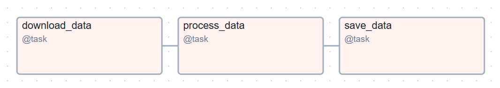

## Предназначение
Используемый Airflow DAG объединяет задачи в единую цепочку задач (data pipeline), где явно видны зависимости между узлами.

DAG выполняется ежедневно в полночь и состоит из следующих задач:
    - Download Data: загрузка данных о погоде из API OpenWeatherMap;
    - Process Data: очистка и преобразование загруженных данных;
    - Save Data: сохранение обработанных данных в файл parquet.
